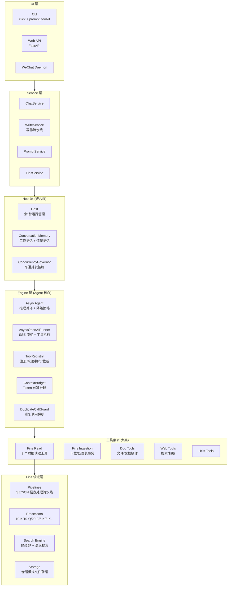
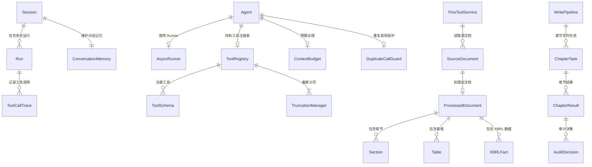
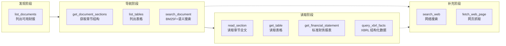
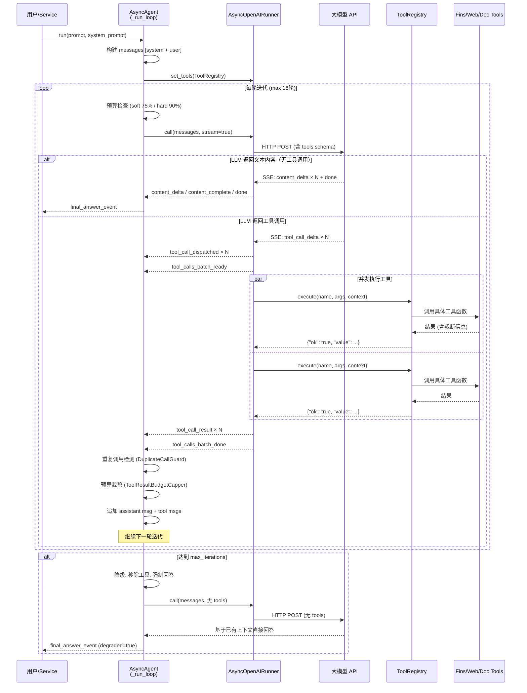
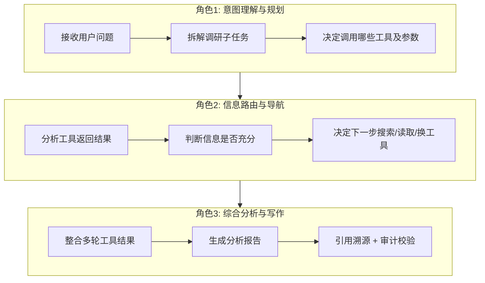
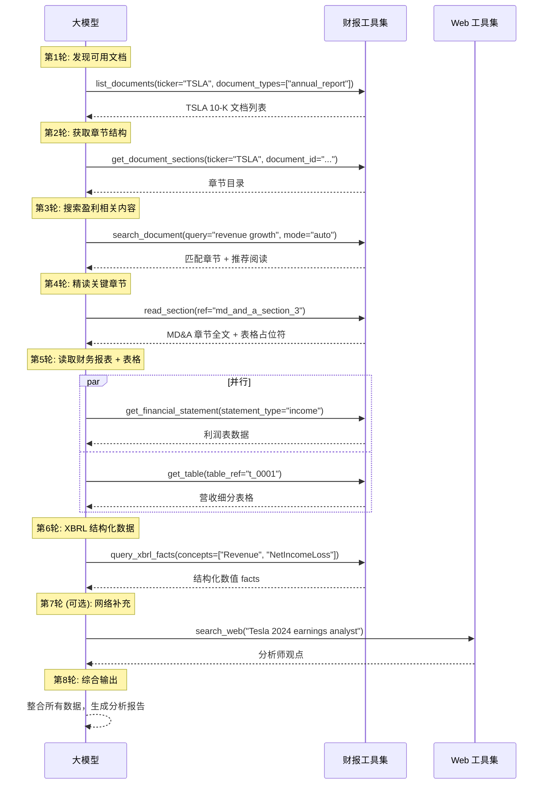
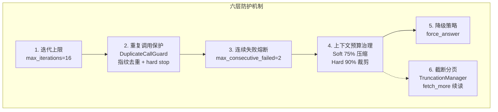
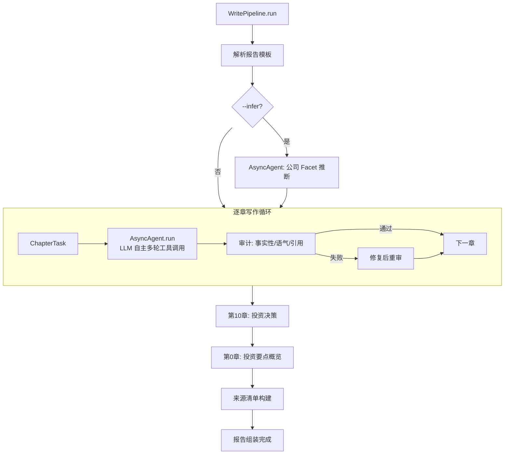
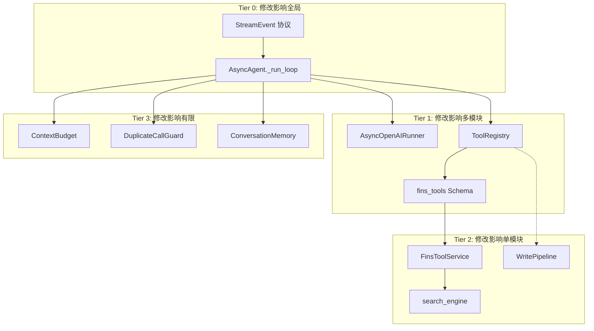

# Dayu-Agent 代码深度分析报告

**分析日期**: 2026-04-17
**分析目标**: 深度解析股票调研机制、大模型角色、多轮工具调用解决方案
**用户角色**: 开发人员

---

## 1. 项目概览

**Dayu-Agent** ("大愚 Agent") 是一个买方财报分析 Agent 系统，定位为 **LLM + 结构化财报工具 + 财报下载/预处理流水线 + 报告写作统一系统**。

- **语言**: Python 3.11+
- **许可证**: Apache 2.0
- **分层架构**: UI → Service → Host → Engine → Tools → Domain

### 技术栈

| 分类 | 技术 |
|------|------|
| **语言** | Python 3.11+ |
| **LLM 接入** | OpenAI 兼容 HTTP API (DeepSeek / OpenAI / Claude / Gemini / Qwen / Mimo) |
| **财报数据源** | SEC EDGAR (edgartools) + 中国财报 |
| **文档处理** | Docling, BeautifulSoup4, lxml, trafilatura, readability-lxml |
| **Web** | FastAPI, Playwright, aiohttp, httpx |
| **CLI** | Click + prompt_toolkit |
| **存储** | SQLite (会话/运行记录), 本地文件系统 (财报文档) |
| **搜索** | BM25F + 语义搜索 (多策略搜索引擎) |
| **数据** | Pandas, XBRL 结构化数据查询 |

---

## 2. 静态结构分析

### 2.1 分层架构总览



### 2.2 核心实体关系 (ER)



### 2.3 5 大工具集

| 工具集 | 工具数量 | 核心工具 | 用途 |
|--------|----------|----------|------|
| **Fins Read** | 9 | `list_documents`, `search_document`, `read_section`, `get_table`, `get_financial_statement`, `query_xbrl_facts` 等 | 财报结构化读取 |
| **Fins Ingestion** | 6 | `start_download`, `query_download_status`, `start_process`, `query_process_status` 等 | SEC 文件下载/处理长事务 |
| **Doc** | 5 | `list_files`, `get_file_sections`, `search_files`, `read_file`, `read_file_section` | 本地文件/文档操作 |
| **Web** | 2 | `search_web`, `fetch_web_page` | 互联网搜索与抓取 |
| **Utils** | 内置 | `fetch_more` (自动挂载) | 截断结果续读 |

### 2.4 工具链协作关系（股票调研视角）



### 2.5 关键设计模式

| 模式 | 实现位置 | 说明 |
|------|----------|------|
| **Protocol 依赖倒置** | `engine/protocols.py` | `AsyncRunner`, `ToolExecutor` 均为 Protocol 接口 |
| **工具注册装饰器** | `engine/tools/base.py` | `@tool` 装饰器统一挂载 Schema、截断、安全声明 |
| **事件流架构** | `engine/events.py` | 统一 `StreamEvent` 异步迭代器，支持 SSE 实时推送 |
| **场景化 Prompt 组合** | `config/prompts/` | Base + Scene + Task 三层组合，Manifest 控制 |
| **双层记忆** | `host/conversation_memory.py` | Working Memory (近期完整) + Episodic Memory (历史摘要) |
| **预算治理** | `engine/context_budget.py` | Soft 75% / Hard 90% 阈值，公平裁剪算法 |
| **重复调用保护** | `engine/duplicate_call_guard.py` | 指纹去重 + 连续无增量计数 + poll_until_terminal 特化 |

---

## 3. 动态流程分析

### 3.1 多轮工具调用循环总览



### 3.2 LLM 在股票调研中的三大角色



| 角色 | 具体职责 | 代码位置 |
|------|----------|----------|
| **意图理解与规划** | 解析用户自然语言 → 选择合适工具 + 构造参数 | `async_agent.py:490-554` |
| **信息路由与导航** | 分析工具返回 → 判断需要更多数据 → 自主决定下一步 | `async_agent.py:695-812` |
| **综合分析与写作** | 将所有工具返回的结构化数据综合成分析报告 | `write_pipeline/pipeline.py` |

### 3.3 股票调研完整链路 (以 Tesla 2024 年报为例)



### 3.4 多轮工具调用问题的解决方案 — 六层防护机制



#### 各机制详解

**1. 迭代上限** (`async_agent.py:490`)
- 默认 max_iterations=16，实测 p99 在 10 轮以内
- while 循环硬性终止条件

**2. 重复调用保护** (`duplicate_call_guard.py:69-128`)
- 指纹机制：对 (工具名 + 参数) 做 SHA256 签名，对结果也做 SHA256 指纹
- 第1次重复 → emit_hint → 注入软提醒
- 第2次重复 → hard_stop → 触发降级
- poll_until_terminal 模式豁免（长事务轮询场景）

**3. 连续失败熔断** (`async_agent.py:713-724`)
- 连续 2 批工具调用全部失败 → 立即终止
- 避免系统性错误导致无效重试

**4. 上下文预算治理** (`context_budget.py`)
- Soft 阈值 (75%) → 主动压缩消息 (compaction)
- Hard 阈值 (90%) → 预测性裁剪工具结果
- 压缩策略：保留 system + 首条 user + 最近 6 条，中间替换为摘要
- 裁剪策略：小结果优先保留完整，大结果按比例裁剪，单个最低 4000 chars

**5. 降级策略** (`async_agent.py:850-865`)
- 触发条件：达到 max_iterations / 连续失败 / 重复调用 hard_stop
- 降级行为：移除 tools schema → 追加 fallback_prompt → LLM 被迫基于已有上下文回答

**6. 截断分页** (`truncation_manager.py`)
- 工具结果过大时自动截断，返回 truncation.next_action="fetch_more"
- LLM 可自主调用 fetch_more(cursor, scope_token) 续读

### 3.5 调用链汇总

| 入口 | 调用路径 | 出口 |
|------|----------|------|
| `CLI: dayu interactive` | main → ChatService → Host → AsyncAgent → Runner → LLM | CLI 实时输出 |
| `CLI: dayu prompt` | main → PromptService → Host → AsyncAgent → Runner → LLM | 单次输出 |
| `CLI: dayu write` | main → WriteService → WritePipeline → Host(每章) → AsyncAgent → Runner → LLM | 报告文件 |
| `Web API: /chat` | FastAPI → ChatService → Host → AsyncAgent → Runner → LLM | SSE 流 |
| `WeChat` | Daemon → ChatService → Host → AsyncAgent → Runner → LLM | 微信消息 |

### 3.6 写作流水线



---

## 4. 影响面分析

### 4.1 核心变更影响范围



### 4.2 风险评估表

| 变更目标 | 直接影响 | 间接影响 | 测试覆盖 | 风险等级 |
|----------|----------|----------|----------|----------|
| **AsyncAgent._run_loop** | Runner 事件消费、工具结果回填、降级逻辑 | ChatService / WriteService / PromptService 所有场景 | test_async_agent.py + 4 个扩展 | 高 |
| **AsyncOpenAIRunner.call** | SSE 解析、工具调用派发、重试机制 | 所有 Agent 调用链路 | test_async_openai_runner.py + 2 个扩展 | 高 |
| **ToolRegistry.execute** | 参数校验、路径安全、截断、中间件 | 所有工具调用 (fins/web/doc) | test_tool_registry_v2.py + 2 个扩展 | 中 |
| **FinsToolService** | 9 个财报工具的底层服务路由 | 所有财报读取能力 | test_fins_tools_service.py | 中 |
| **ContextBudgetState** | 预算阈值计算、裁剪决策 | Agent 每轮迭代的压缩/裁剪 | test_context_budget.py | 低 |
| **DuplicateCallGuard** | 重复调用检测、hard_stop 决策 | Agent 提前退出逻辑 | 内嵌在 test_async_agent | 低 |
| **fins_tools Schema** | LLM 看到的工具描述和参数 | LLM 工具选择行为 | test_fins_tools_registry.py | 中 |
| **search_engine.py** | BM25F + 语义搜索质量 | search_document 工具结果质量 | test_search_mode_and_scale.py | 中 |
| **WritePipeline** | 多章节编排、审计、重写 | dayu write 命令端到端 | test_write_pipeline.py | 中 |
| **StreamEvent 协议** | 全链路事件类型 | Runner / Agent / Host 三层 | 全部 engine 测试 | 高 |

### 4.3 架构边界保护

```
enforced boundary:
  UI → Service → Host → Engine → (Contracts)

  禁止反向依赖:
  Engine ✗→ Host
  Engine ✗→ Service
  Engine ✗→ UI
  Host ✗→ Service
```

关键 Protocol 接口实现依赖倒置：

| 接口 | 定义层 | 实现层 |
|------|--------|--------|
| `AsyncRunner` | `engine/protocols.py` | `engine/async_openai_runner.py` |
| `ToolExecutor` | `engine/protocols.py` | `engine/tool_registry.py` |
| `ToolTraceRecorder` | `engine/tool_trace.py` | Host 层注入 |
| `HostExecutorProtocol` | `host/` | `host/executor.py` |

### 4.4 变更建议

1. **修改 AsyncAgent 时** — 确保所有 test_async_agent*.py (5 个文件) 通过
2. **修改工具 Schema 时** — 注意 LLM 行为会因 description 变化而改变，用黄金测试验证
3. **修改 Runner 时** — SSE 解析和工具执行是核心路径，3 个 runner 测试文件必须全通过
4. **新增工具时** — 只需在 fins_tools.py 添加工厂函数 + 注册到 read_tool_factories 列表
5. **修改预算参数时** — 只改 run.json 配置即可，无需改代码

---

## 5. 总结

### Dayu-Agent 股票调研核心机制

1. **LLM 作为"大脑"** — 负责意图理解、信息导航、综合分析三大角色，自主决定调用哪些工具
2. **工具作为"手脚"** — 9 个财报工具 + Web/Doc 工具，覆盖从文档发现到数据提取的完整链路
3. **六层防护解决多轮调用** — 迭代上限、重复保护、失败熔断、预算治理、降级策略、截断分页
4. **写作流水线编排** — 逐章独立执行 Agent 推理循环，支持审计校验和修复重写
