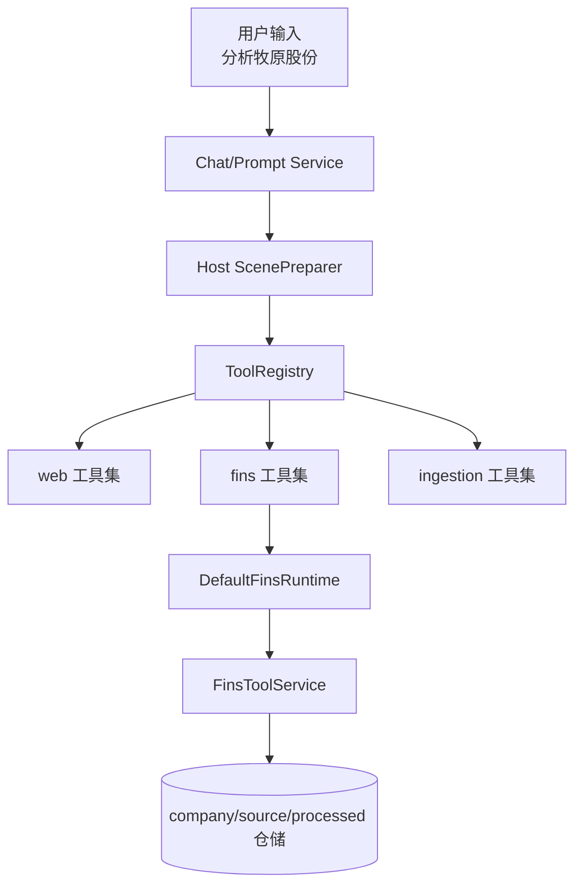
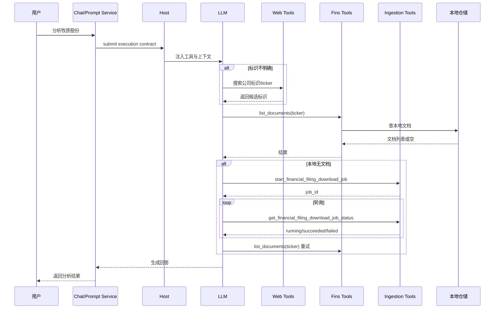

# Dayu-Agent 代码分析报告

**分析日期**: 2026-04-21  
**分析目标**: 分析“输入 `分析牧原股份` 时系统如何获取数据”  
**用户角色**: 开发人员

---

## 1. 结构分析结论

系统数据获取主干是：

`Chat/Prompt Service -> Host ScenePreparer -> ToolRegistry -> (web | fins | ingestion)`

关键点：
- `interactive` / `prompt` 场景会启用 `web + fins + ingestion` 三类工具。
- `fins` 读取链路核心入口是 `list_documents(ticker)`，偏向 ticker 输入。
- 本地无文档时通过 ingestion 下载任务补数，再回到 fins 读取。

---

## 2. 流程分析结论

### 2.1 调用链

1. 用户输入自然语言问题（例如“分析牧原股份”）。
2. Service 层提交 execution contract。
3. Host 根据 scene 装配工具。
4. LLM 先决策标识（必要时使用 web）。
5. 调用 `list_documents(ticker)` 进入本地财报读取。
6. 若无文档，调用下载任务工具并轮询状态。
7. 下载完成后再次读取并输出结论。

### 2.2 时序图

---

## 3. 影响面分析结论

### 3.1 依赖影响

**直接影响模块**：
- `dayu/services/chat_service.py`
- `dayu/services/prompt_service.py`
- `dayu/services/prompt_contributions.py`
- `dayu/fins/tools/service.py`
- `dayu/fins/storage/fs_company_meta_repository.py`
- `dayu/fins/storage/_fs_company_meta_core.py`

**间接影响模块**：
- `dayu/cli/dependency_setup.py`
- `dayu/fins/service_runtime.py`
- `dayu/wechat/main.py`
- `dayu/fins/toolset_registrars.py`
- `dayu/fins/tools/ingestion_tools.py`
- `dayu/config/toolset_registrars.json`

### 3.2 风险评估

| 风险项 | 风险等级 | 说明 | 缓解建议 |
|---|---|---|---|
| 公司名直入 fins 导致契约漂移 | 高 | 与当前 ticker 优先契约冲突 | 增加独立“公司名->ticker”解析层 |
| ticker 解析歧义导致误命中 | 高 | alias 命中不稳定 | 增加置信度与冲突回退 |
| 无文档时频繁误触发下载 | 中 | 耗时与资源开销上升 | 下载前增加二次校验 |
| 多入口行为不一致 | 中 | CLI/Wechat/Interactive 结果偏差 | 统一解析组件 |

### 3.3 测试建议

- 增加公司名解析成功/失败/歧义分支单测。
- 增加 `list_documents` 在 ticker/alias 变体下的一致性测试。
- 增加“本地无文档 -> 下载 -> 回流读取”的端到端测试。
- 增加 CLI/Wechat/Prompt 三入口一致性回归测试。

---

## 4. 结论

当前项目在“拿数据”上的核心策略是：**先标识、再本地读取、缺失再补数、必要时联网补充**。  
如果要优化“公司名直接分析”的体验，建议保持 fins 的 ticker 契约不变，在其前面新增稳定的公司名解析层。
