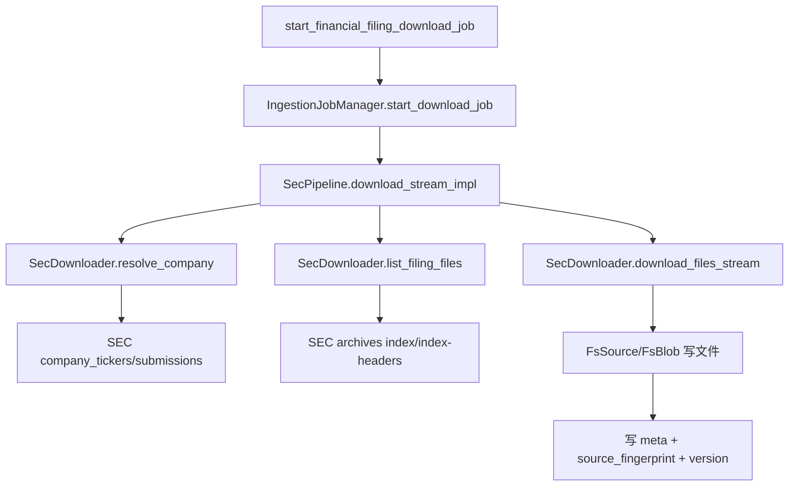
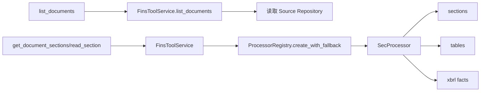
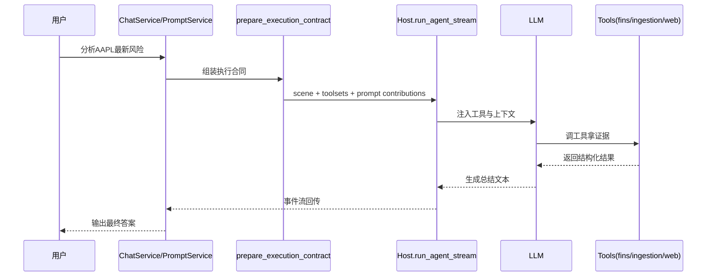

# Dayu-Agent 代码分析报告（超详细版）

> **分析日期**: 2026-04-21  
> **分析目标**: 详细说明“如何拿数据 -> 如何解析 -> 如何发给大模型输出结果”，并给出函数级示例  
> **用户角色**: 开发人员

---

## 1. 一句话结论

系统不是“直接把网页丢给模型”，而是走一条强约束流水线：

1. 先通过 `ingestion` 工具把财报从 SEC 下载并落盘；
2. 再通过 `fins` 工具把本地文档解析成结构化证据（章节、表格、XBRL facts）；
3. 最后由 `ChatService/PromptService + Host` 把工具结果喂给模型，模型据此生成总结。

---

## 2. 会去哪些网站拿数据

## 2.1 主数据网站（财报主链路）

来自 `dayu/fins/downloaders/sec_downloader.py`：

- `https://www.sec.gov/files/company_tickers.json`
  - 用途：ticker -> CIK/company 映射。
- `https://data.sec.gov/submissions/CIK{cik10}.json`
  - 用途：公司 filings 主清单（recent + history 索引）。
- `https://www.sec.gov/Archives/edgar/data/{cik}/{accession}/index.json`
  - 用途：单份 filing 的文件列表（主文档、XBRL、附件）。
- `https://www.sec.gov/Archives/.../{accession}-index-headers.html`
  - 用途：补充文档类型、描述、SC13 关键字段。
- `https://www.sec.gov/cgi-bin/browse-edgar?...&output=atom`
  - 用途：补齐 submissions 场景不足，做兜底查询。

## 2.2 补充网站（可选补证链路）

来自 `dayu/engine/tools/web_tools.py`：

- `search_web`：provider 优先顺序 `tavily -> serper -> duckduckgo`
- `fetch_web_page`：默认 `requests`，被反爬时回退 `playwright`

说明：Web 工具是“补充证据”，不是财报主数据真源。

---

## 3. 拿到数据后如何处理（下载+落盘）

## 3.1 函数级调用链（下载阶段）

## 3.2 处理机制细节

1. **公司标识解析**
   - `resolve_company()` 先按 ticker map 查；失败会走 browse-edgar fallback。

2. **filing 过滤**
   - `SecPipeline._filter_filings()` 按 form、时间窗口、方向规则过滤。

3. **远端文件组装**
   - `list_filing_files()` 决定要抓哪些文件：
     - 主文档
     - XBRL instance/taxonomy
     - 6-K exhibit 与关联 html

4. **下载与健壮性**
   - 支持 `If-None-Match/If-Modified-Since`
   - 命中 `304` 跳过
   - 429/503 限流退避
   - 失败事件结构化返回（file_failed）

5. **落盘**
   - 通过 `dayu.fins.storage` 仓储写入 source/blob/meta。
   - 计算 `source_fingerprint`，用于 skip/rebuild 判断。

## 3.3 示例（下载）

**输入**：`start_financial_filing_download_job(ticker="AAPL", form_types=["10-K"])`

**过程**：
- 查到 AAPL 的 CIK；
- 拉 submissions 找最近 10-K；
- 进 archives 拉 index.json；
- 下载主文档 + XBRL 文件；
- 写入本地仓储并更新 meta。

**输出（概念上）**：
- `job.status: running -> succeeded`
- 本地出现 `fil_*` 文档目录与 meta 信息。

---

## 4. 拿到数据后如何解析（解析阶段）

## 4.1 函数级调用链（解析阶段）

## 4.2 解析机制细节

1. **路由层**
   - `FinsToolService` 负责：
     - ticker/document_id 标准化；
     - `source_kind -> processor` 路由；
     - citation 组装；
     - 结构化结果统一。

2. **SecProcessor 核心能力**
   - `list_sections/read_section`：章节树与正文。
   - `list_tables/read_table`：表格元数据与内容。
   - `get_financial_statement/query_xbrl_facts`：结构化财务数据。

3. **解析输入来源**
   - 解析的不是互联网 URL，而是仓储中的本地 source 文件。

4. **输出形态**
   - 模型拿到的是工具 JSON 结果（结构化），不是原始下载字节流。

## 4.3 示例（解析）

**输入调用序列（典型）**：
1. `list_documents("AAPL")`
2. `get_document_sections(document_id="fil_xxx")`
3. `read_section(ref="s_0007")`
4. （可选）`query_xbrl_facts(concepts=[...])`

**返回（概念上）**：
- `sections`: 章节引用、标题、层级；
- `content`: 章节文本（含表格占位符）；
- `facts`: 数值 facts（概念、期间、值）。

## 4.4 每种格式的具体解析过程（逐步）

> 本节专门回答“每个解析到底怎么做”的问题，按格式逐步展开：输入 -> 处理步骤 -> 输出 -> 异常处理。

### 4.4.1 SEC JSON（公司映射与文档索引）解析过程

**输入格式**：
- `company_tickers.json`
- `submissions/CIKxxxx.json`
- `Archives/.../index.json`
- `browse-edgar atom`（兜底）

**解析步骤**：
1. 发起 HTTP 请求并检查状态码；失败走重试/退避。
2. 对响应做 JSON 反序列化（`response.json()`）；解析失败记录错误并终止该分支。
3. 按目标字段提取结构化信息：
   - ticker 映射：`ticker/cik/title`
   - filings 清单：`form/filingDate/accessionNumber/primaryDocument`
   - 文件目录：`directory.item[].name/type/size`
4. 把提取结果转换为内部模型：
   - `FilingRecord`
   - `RemoteFileDescriptor`
5. 进入下一阶段（下载实际文件）。

**输出**：
- 可下载的 filing 列表
- 单 filing 文件清单（主文档、XBRL、附件）

**异常与降级**：
- JSON 结构不符合预期：该 filing 失败或跳过，并携带 `reason_code`；
- 字段缺失：尝试 browse-edgar 补齐，否则终止该条。

---

### 4.4.2 Filing HTML/HTM/TXT 正文解析过程

**输入格式**：
- 下载并落盘后的本地正文文件（HTML/HTM/TXT）

**解析步骤**：
1. `FinsToolService` 定位 `ticker + document_id` 对应本地 source 文件。
2. `ProcessorRegistry` 根据 `form_type/media_type` 选择 `SecProcessor`。
3. `SecProcessor` 读取原始文本，调用文档解析器构建中间文档对象。
4. 执行章节构建：
   - 识别标题和层级；
   - 生成 `section ref`、`parent_ref`；
   - 建立章节索引。
5. 生成章节正文内容：
   - 正文清洗；
   - 插入表格占位符（如果该章节包含表格）。

**输出**：
- `list_sections`：章节目录树
- `read_section`：章节正文（结构化字段 + citation）

**异常与降级**：
- 文档解析失败：尝试有限重试（如大文档阈值放宽一次）；
- 仍失败：该文档解析失败，不返回伪内容。

---

### 4.4.3 表格（Table）解析过程

**输入格式**：
- HTML 文档中的 `<table>` 结构 + DOM 上下文

**解析步骤**：
1. 从文档中提取候选表格节点。
2. 为每个表格生成稳定 `table_ref`。
3. 计算表格元数据：
   - `row_count`
   - `col_count`
   - `headers`
   - `section_ref`
4. 做表格类型判定：
   - 财务表（`is_financial=true`）
   - 布局表/噪声表
5. 读取时输出两种形态之一：
   - records（优先）
   - markdown（兜底）

**输出**：
- `list_tables`：表格目录与元数据
- `get_table/read_table`：表格详情内容

**异常与降级**：
- 表格结构异常：降级为 markdown 文本输出；
- 无法可靠解析：保留最小元数据，避免整体失败。

---

### 4.4.4 XBRL（XML/XSD/Linkbase）解析过程

**输入格式**：
- instance XML
- schema XSD
- presentation/calculation/definition/label（可选）

**解析步骤**：
1. 在当前文档目录发现 XBRL 文件集（自动发现，不依赖固定文件名）。
2. 懒加载 XBRL 对象（只有调用财务工具时才加载）。
3. 解析报表与 facts：
   - `statement` 级别（利润表/资产负债表/现金流）
   - `concept` 级别（Revenue、NetIncomeLoss 等）
4. 规范化字段：
   - period
   - unit/currency
   - scale
   - value
5. 输出统一结果模型。

**输出**：
- `get_financial_statement`
- `query_xbrl_facts`

**异常与降级**：
- XBRL 文件缺失或损坏：返回 `xbrl_not_available`，`data_quality=partial`；
- 不中断整份文档的章节/表格解析链路。

---

### 4.4.5 6-K Exhibit 附件解析过程

**输入格式**：
- 6-K filing 的主文档与附件（常见 `EX-99.x`）

**解析步骤**：
1. 从 index/index-headers 收集附件候选。
2. 预筛选“可能包含有效业绩信息”的附件。
3. 命中则下载并纳入解析；未命中则按规则跳过。
4. 对命中的附件走与正文一致的章节/表格解析流程。

**输出**：
- 可读的附件章节与表格证据

**异常与降级**：
- 预筛选失败：`6k_prefetch_failed`
- 不符合保留条件：`6k_filtered`（通常 `skipped`）

---

### 4.4.6 Web 页面（补充证据）解析过程

**输入格式**：
- 公开网页 URL（HTML 或非 HTML）

**解析步骤**：
1. URL 安全校验（协议、内网限制等）。
2. `requests` 抓取正文；
3. 根据 content-type 分流：
   - HTML：正文提取 -> Markdown
   - 非 HTML：Docling 转换 -> Markdown
4. 遇到反爬/挑战页时回退 Playwright。
5. 输出统一页面内容字段（title/content/final_url）。

**输出**：
- `fetch_web_page` 的正文证据

**异常与降级**：
- 阻断/挑战：返回结构化错误并提示换源；
- 内容为空：`empty_content`，建议继续但不依赖该源。

---

### 4.4.7 统一归一化与喂给模型过程

无论来源格式如何，最终都要归一化为统一工具结果：

1. 目录类：documents/sections/tables 索引；
2. 内容类：section content/table content/web content；
3. 数值类：xbrl facts/financial statements；
4. 附带 citation 与诊断信息。

然后由 Host 把这些结构化结果写入当前轮上下文，模型据此生成最终总结。

---

## 5. 解析后如何发给大模型输出结果（推理阶段）

## 5.1 函数级调用链（服务到模型）

## 5.2 关键机制

1. **Service 不做总结**
   - `ChatService/PromptService` 负责提交与回流，不负责业务归纳。

2. **Host 不做总结**
   - Host 负责执行 orchestration（工具调用与事件流）。

3. **LLM 才做总结**
   - LLM 根据工具返回证据生成自然语言结论。

4. **工具结果如何进入上下文**
   - 每次 tool call 的结构化返回会进入该轮执行上下文，供后续推理。

## 5.3 示例（从证据到总结）

假设工具返回：
- `read_section`: 风险因素章节有“原材料价格波动”描述；
- `query_xbrl_facts`: 毛利率同比下降。

模型输出就会形成类似：
- 风险 1：成本端波动；
- 风险 2：盈利能力承压；
- 并引用对应章节与数据证据。

---

## 6. 你最关心问题的“端到端示例”

用户输入：`分析 AAPL 最新财报风险`

1. **拿数据**
   - 先 `list_documents`，若为空则 `start_financial_filing_download_job`。
   - SecPipeline + SecDownloader 从 SEC 获取并落盘。

2. **解析数据**
   - `get_document_sections/read_section/query_xbrl_facts`。
   - SecProcessor 从本地 source 解析出结构化证据。

3. **发给模型并输出**
   - Host 将工具结果写入执行上下文。
   - LLM 依据证据生成风险总结文本并返回。

---

## 7. 风险与改造建议（针对你的重点）

## 7.1 风险

| 环节 | 高风险点 | 后果 |
|---|---|---|
| 拿数据 | SEC 字段漂移/限流变化 | 下载失败或漏数 |
| 解析 | section/table/xbrl 结构漂移 | 模型证据链断裂 |
| 输出 | 工具调用顺序错配 | 先 web 后财报，结论跑偏 |

## 7.2 建议

1. 先做稳定的“公司名 -> ticker”解析层，避免误下载。
2. 对 SEC 接口做契约监控（字段级健康检查）。
3. 对 `SecProcessor` 输出做快照回归（section/table/xbrl）。
4. 在提示词中约束优先调用 `fins` 证据，再补 `web`。

---

## 8. 最终回答（精简）

1. **如何拿到数据**：通过 `ingestion_tools -> SecPipeline -> SecDownloader` 从 SEC 下载并落盘。  
2. **拿到后如何解析**：通过 `FinsToolService -> SecProcessor` 解析成本地结构化证据。  
3. **解析后如何发给模型**：`Chat/Prompt Service` 装配执行合同，Host 驱动 LLM 调工具拿证据后生成总结并输出。

