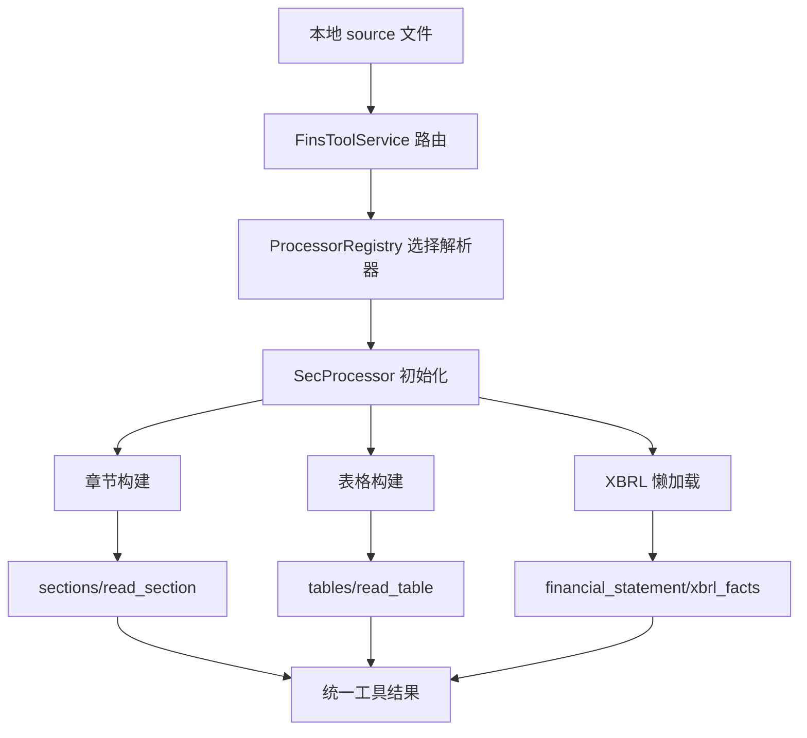

# Dayu-Agent 解析内部机制说明（独立文档）

> 日期：2026-04-21  
> 范围：下载后文件如何解析；标题/章节如何匹配；异常格式如何处理

---

## 1. 文档目标

这份文档专门回答三个问题：

1. 数据下载后，系统如何进入解析流程；
2. 标题、章节是怎么匹配出来的；
3. 如果格式不标准，系统如何降级或失败返回。

---

## 2. 解析总流程（从本地文件到结构化证据）

核心要点：

- 解析针对的是**本地已落盘文件**，不是在线网页流；
- 先选解析器，再做章节/表格/XBRL 三条能力构建；
- 最终统一成工具结果供大模型消费。

---

## 3. 标题与章节匹配机制（重点）

## 3.1 章节候选来源

解析器先从文档对象中读取 `sections` 候选（来自 edgar 文档结构）。  
如果拿不到候选，会降级为“单全文章节”。

## 3.2 标题生成规则（优先级）

章节标题不是直接取一个字段，而是按优先级生成：

1. `part + item`（例如 `Part I Item 1A`）
2. `title`
3. `name`
4. `section_key`（最后兜底）

这保证了标题有稳定的业务语义，不依赖源文档大小写和排版细节。

## 3.3 章节位置定位（多信号）

每个章节都会计算两类“出现位置”：

- **正文 marker 命中**：用章节正文前缀（前 28/24/20...词）在全文查找；
- **anchor 命中**：用 `part/item/title/key` 组成锚点词查找。

然后合并去重，形成候选位置集合。

## 3.4 目录（TOC）干扰消除

为了避免把目录中的“Item 1A”误判成正文章节，系统会做两层过滤：

1. 先找正文起点锚（优先 `Part I Item 1`）；
2. 再找 `table of contents` 的最后位置并加缓冲区。

最终只保留正文区内候选位置。

## 3.5 最终排序与稳定 ref

章节最终排序键：

1. `anchor_sequence`（若可解析）
2. `appearance_index`（正文出现顺序）
3. `original_index`（兜底）

排序后统一重编号为 `s_0001`、`s_0002`...  
这就是后续 `read_section(ref)` 能稳定工作的基础。

---

## 4. 各格式的解析过程

## 4.1 SEC JSON（索引型）

输入：
- ticker map / submissions / index.json / atom

过程：
1. 请求与重试；
2. JSON 反序列化；
3. 抽取 filing 清单与文件清单；
4. 映射为内部结构（FilingRecord、RemoteFileDescriptor）。

输出：
- 可下载的 filing 列表；
- 单 filing 文件目录。

## 4.2 HTML/HTM/TXT（正文型）

输入：
- 本地正文文件

过程：
1. 读取文本并构建文档对象；
2. 章节切分、标题生成、层级组织；
3. 文本清洗与占位符插入。

输出：
- `list_sections`、`read_section`

## 4.3 Table（结构化表格）

输入：
- DOM 表格节点 + 前文上下文

过程：
1. 提取表格候选；
2. 生成 `table_ref`；
3. 计算行列/表头/财务属性；
4. 读表时优先 records，不行则 markdown。

输出：
- `list_tables`、`read_table/get_table`

## 4.4 XBRL（数值型）

输入：
- instance/schema/linkbase 文件集

过程：
1. 自动发现文件；
2. 懒加载 XBRL 对象；
3. 按 concept/period 提取 facts；
4. 统一单位、币种、尺度。

输出：
- `query_xbrl_facts`、`get_financial_statement`

## 4.5 6-K 附件（特殊型）

输入：
- 6-K 主文档 + EX-99 附件

过程：
1. 预筛选有效附件；
2. 命中附件再进入正文解析流程；
3. 未命中则跳过并记录原因。

输出：
- 命中时提供章节/表格证据；
- 未命中时提供结构化跳过原因。

---

## 5. 异常格式处理策略

总体策略：**可降级则降级，不可降级则失败并给 reason_code**。

常见行为：

- 下载层：
  - `download_error` / `empty_response` / `empty_content` / `file_download_failed`
- 6-K 预筛选：
  - `6k_filtered` / `6k_prefetch_failed`
- XBRL 不可用：
  - `xbrl_not_available` + `data_quality=partial`
- 解析器无法匹配：
  - 解析器回退；全部失败则报错，不输出伪结构。

---

## 6. 与大模型的接口边界

大模型不直接读原始文件，而是读工具层的结构化结果：

- 章节证据：`sections/read_section`
- 表格证据：`list_tables/get_table`
- 数值证据：`query_xbrl_facts/get_financial_statement`

这样做的好处：

1. 格式异构被解析层屏蔽；
2. 模型输入更稳定；
3. 异常可观测、可追溯。

---

## 7. 结论

标题/章节匹配是“多信号融合 + TOC 去噪 + 稳定排序”的工程化方案，不是单规则匹配。  
面对异常格式，系统优先返回可诊断的结构化失败信息，避免静默错误影响最终分析结论。

