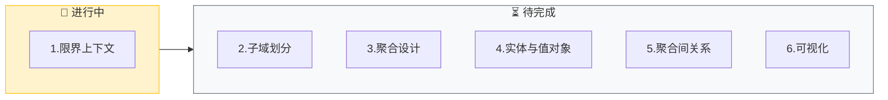
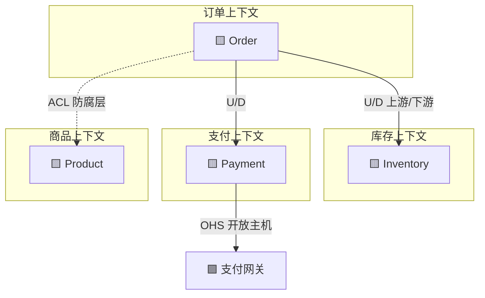
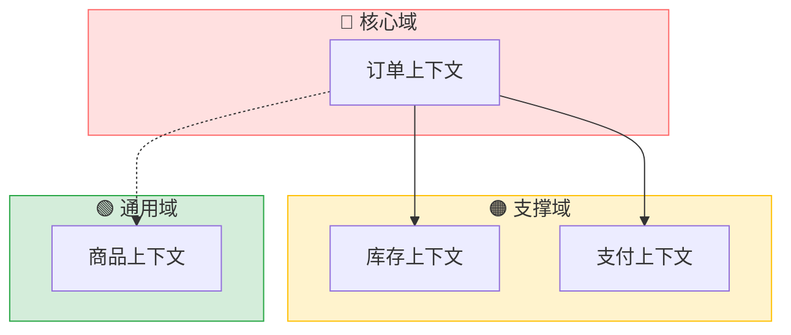
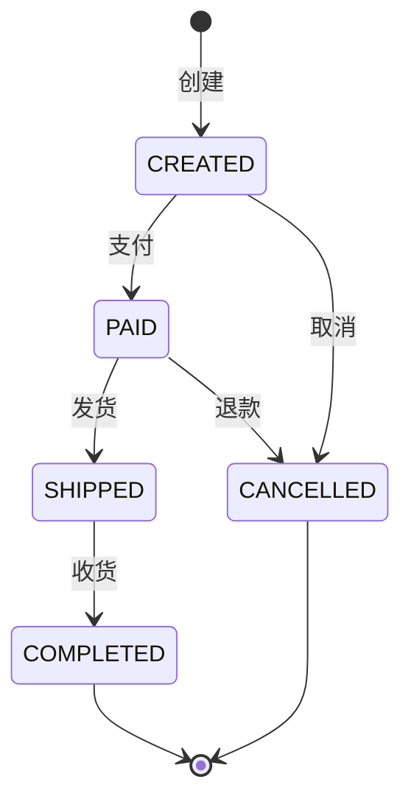
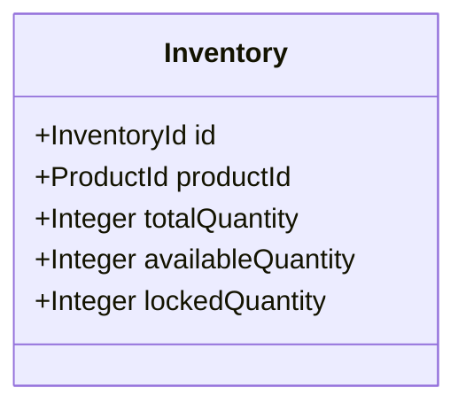
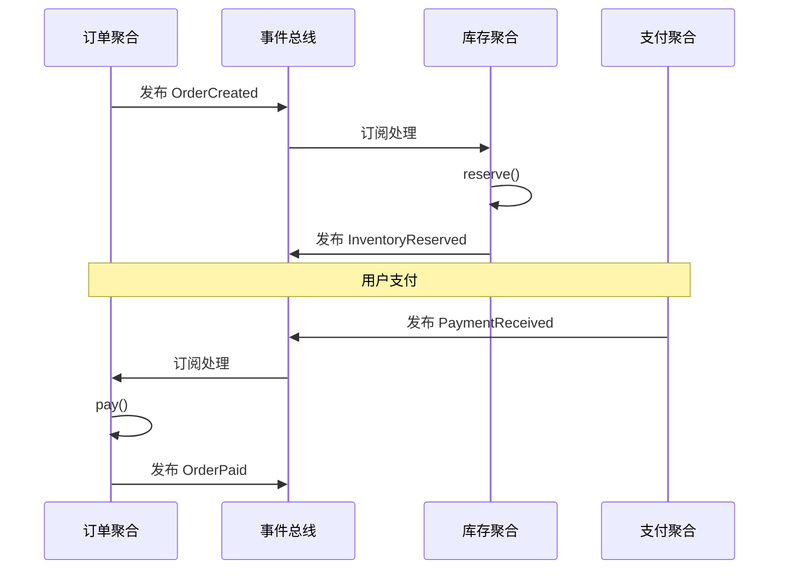
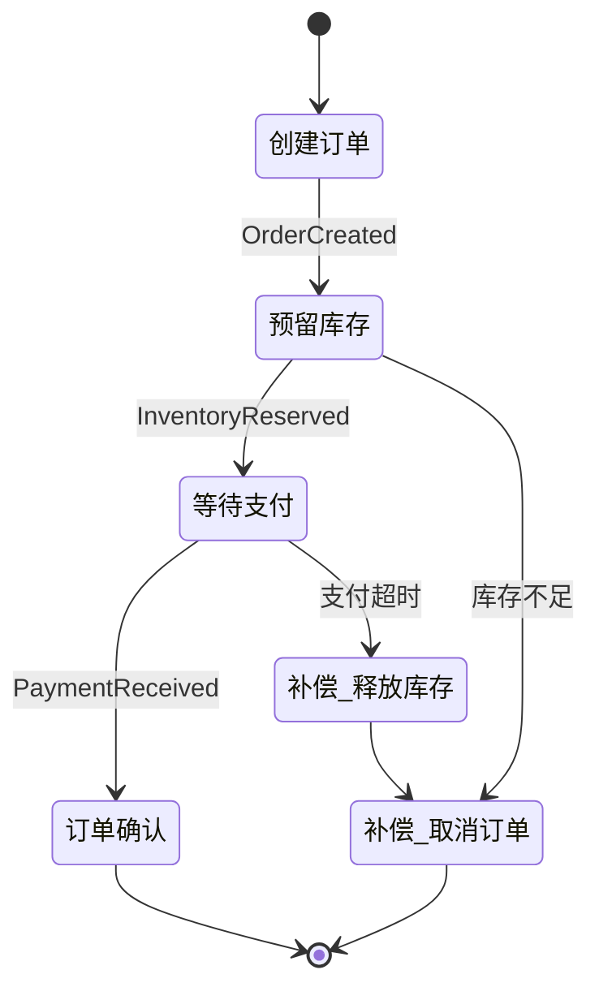
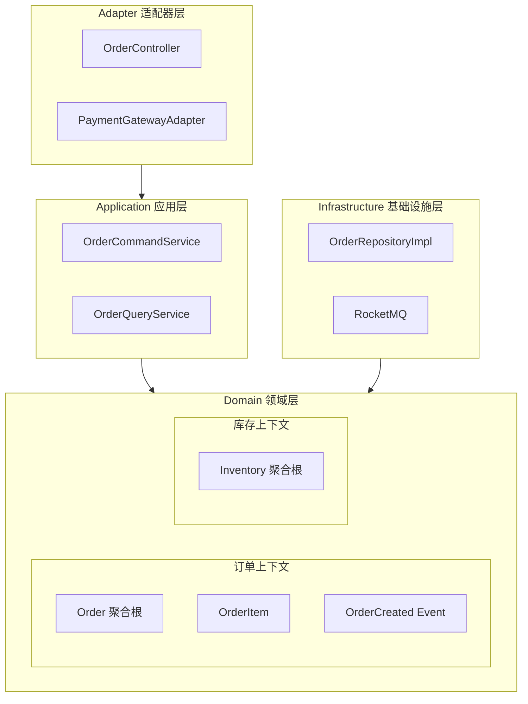
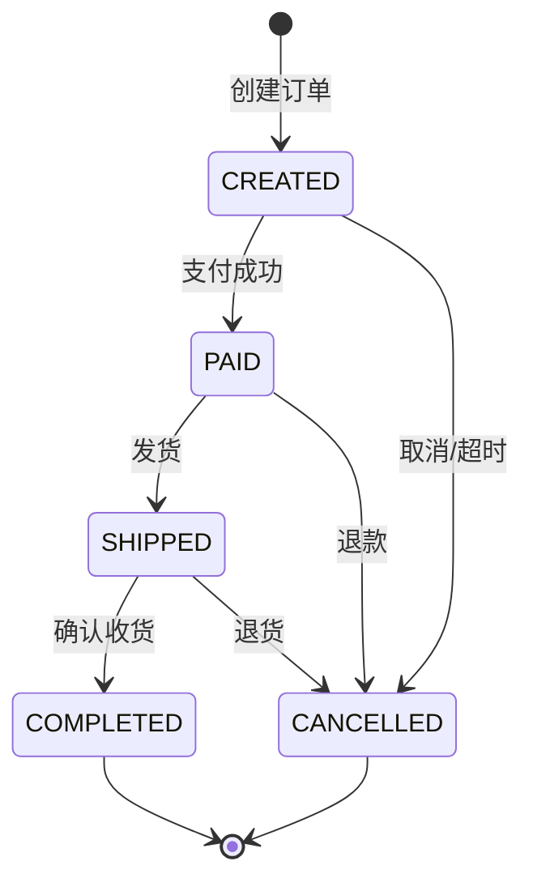

# DDD 建模指令 (DDD Modeling Instructions)

> **交互协议**: 本指令遵循 `jl-skills/instructions/INTERACTION_PROTOCOL.md` 中定义的交互规范。
> **输出模板**: `jl-skills/templates/JL-Template-DDD-Design.md` (建模部分)
> **前置条件**: 事件风暴已完成

---

## Part A: 限界上下文

### 步骤 1: 限界上下文划分

**输出**:

````markdown
## 步骤 1: 限界上下文划分

**目标**: 识别并划分限界上下文

📊 **DDD建模进度**: [1/6] 限界上下文
[███░░░░░░░░░░░░░░░░░] 16%



---

### 限界上下文清单

| 限界上下文 | 核心业务关注点 | 包含的聚合 | 关键领域事件 |
|------------|----------------|------------|--------------|
| **订单上下文** | 订单全生命周期管理 | Order, OrderItem | OrderCreated, OrderPaid, OrderShipped |
| **库存上下文** | 库存数量管理 | Inventory, StockRecord | InventoryReserved, InventoryReleased |
| **支付上下文** | 支付交易处理 | Payment, PaymentRecord | PaymentReceived, PaymentFailed |
| **商品上下文** | 商品信息管理 | Product, Category | ProductUpdated |

### Context Map



**上下文关系类型**:
- **U/D (Upstream/Downstream)**: 上下文直接依赖
- **ACL (Anti-Corruption Layer)**: 防腐层隔离
- **OHS (Open Host Service)**: 开放主机服务

---

📋 **确认检查点**

- 回复 **确认** → 进入子域划分
- 回复 **调整边界** → 我将重新划分

**请确认：** 限界上下文划分是否合理？
````

**[等待用户确认]**

---

### 步骤 2: 子域划分

**输出**:

````markdown
## 步骤 2: 子域划分

**目标**: 区分核心域、支撑域、通用域

📊 **DDD建模进度**: [2/6] 子域划分
[██████░░░░░░░░░░░░░░] 33%

---

### 子域划分

| 子域类型 | 限界上下文 | 说明 |
|----------|------------|------|
| 🔴 **核心域** | 订单上下文 | 业务核心竞争力 |
| 🟠 **支撑域** | 库存上下文 | 支撑核心业务 |
| 🟠 **支撑域** | 支付上下文 | 必要能力 |
| 🟢 **通用域** | 商品上下文 | 通用能力 |

### 子域关系图



---

📋 **确认检查点**

- 回复 **确认** → 进入聚合设计
- 回复 **调整分类** → 我将修改

**请确认：** 子域划分是否准确？
````

**[等待用户确认]**

---

## Part B: 领域建模

### 步骤 3: 聚合根设计

**输出**:

> ⚠️ **必须遵循** `jl-skills/specs/DDD与可视化规范.md` 中的：
> - **贫血模型规范**（只含属性）
> - **Mermaid classDiagram 语法规范**（所有类必须先定义，关系语法正确）

````markdown
## 步骤 3: 聚合根设计

**目标**: 设计聚合根结构（贫血模型，不含代码）

📊 **DDD建模进度**: [3/6] 聚合设计
[█████████░░░░░░░░░░░] 50%

---

### 聚合: Order (订单)

| 属性 | 类型 | 说明 |
|------|------|------|
| **聚合根** | Order | 订单实体，控制订单生命周期 |
| **选择原因** | - | 订单是业务核心概念 |

#### 聚合根类图

```mermaid
classDiagram
    class Order {
        <<聚合根>>
        +OrderId id
        +UserId userId
        +OrderStatus status
        +Money totalAmount
        +List~OrderItem~ items
        +LocalDateTime createdAt
    }
    
    class OrderItem {
        <<实体>>
        +OrderItemId id
        +ProductId productId
        +String productName
        +Integer quantity
        +Money unitPrice
    }
    
    %% ========== 关系定义 ==========
    Order ||--o{ OrderItem : contains
```

**⚠️ 语法检查**:
- ✅ 所有类在使用前都已定义
- ✅ 使用标准 Mermaid 关系语法（`||--o{`）

#### 状态转换



#### 领域行为（由领域服务实现）

| 行为 | 触发条件 | 产生事件 | 业务规则 |
|------|----------|----------|----------|
| 创建订单 | 用户提交 | OrderCreated | 订单项不能为空 |
| 支付订单 | 支付成功 | OrderPaid | 状态=CREATED |
| 发货 | 卖家发货 | OrderShipped | 状态=PAID |
| 完成订单 | 确认收货 | OrderCompleted | 状态=SHIPPED |
| 取消订单 | 用户取消 | OrderCancelled | 状态=CREATED/PAID |

### 聚合: Inventory (库存)

#### 聚合根类图



#### 领域行为（由领域服务实现）

| 行为 | 触发条件 | 产生事件 | 业务规则 |
|------|----------|----------|----------|
| 预留库存 | 订单创建 | InventoryReserved | 可用 >= 预留 |
| 释放库存 | 订单取消 | InventoryReleased | 锁定 >= 释放 |
| 扣减库存 | 订单完成 | InventoryDeducted | 从锁定转扣减 |

---

📋 **确认检查点**

- 回复 **确认** → 进入实体与值对象设计
- 回复 **调整设计** → 我将修改

**请确认：** 聚合根设计是否合理？
````

**[等待用户确认]**

---

### 步骤 4: 实体与值对象设计

**输出**:

> ⚠️ **必须遵循** `jl-skills/specs/DDD与可视化规范.md` 中的：
> - **贫血模型规范**（只含属性）
> - **Mermaid classDiagram 语法规范**（所有类必须先定义，关系语法正确）

````markdown
## 步骤 4: 实体与值对象设计

**目标**: 设计聚合内的实体和值对象（仅结构）

📊 **DDD建模进度**: [4/6] 实体与值对象
[████████████░░░░░░░░] 66%

---

### 聚合: Order 内部结构

```mermaid
classDiagram
    class Order {
        <<聚合根>>
        +OrderId id
        +UserId userId
        +OrderStatus status
        +Money totalAmount
        +Address shippingAddress
        +List~OrderItem~ items
    }
    
    class OrderItem {
        <<实体>>
        +OrderItemId id
        +ProductId productId
        +String productName
        +Integer quantity
        +Money unitPrice
    }
    
    class OrderId {
        <<值对象>>
        +String value
    }
    
    class Money {
        <<值对象>>
        +BigDecimal amount
        +Currency currency
    }
    
    class OrderStatus {
        <<值对象/枚举>>
        CREATED
        PAID
        SHIPPED
        COMPLETED
        CANCELLED
    }
    
    class Address {
        <<值对象>>
        +String province
        +String city
        +String district
        +String detail
    }
    
    %% ========== 关系定义 ==========
    Order ||--o{ OrderItem : contains
    Order --> OrderId : identity
    Order --> OrderStatus : has
    Order --> Money : totalAmount
    Order --> Address : shippingAddress
    OrderItem --> Money : unitPrice
```

**⚠️ 语法检查**:
- ✅ 所有类在使用前都已定义
- ✅ 使用标准 Mermaid 关系语法（`||--o{`, `-->`）

### 实体 vs 值对象 判断

| 概念 | 类型 | 判断依据 |
|------|------|----------|
| Order | 聚合根 | 有唯一标识，生命周期管理 |
| OrderItem | 实体 | 有唯一标识，可独立查询 |
| Money | 值对象 | 无标识，按属性值相等 |
| Address | 值对象 | 无标识，整体替换 |
| OrderStatus | 值对象 | 枚举，无标识 |
| OrderId | 值对象 | 标识符，不可变 |

---

📋 **确认检查点**

- 回复 **确认** → 进入聚合间关系
- 回复 **调整** → 我将修改

**请确认：** 实体与值对象划分是否正确？
````

**[等待用户确认]**

---

### 步骤 5: 聚合间关系设计

**输出**:

````markdown
## 步骤 5: 聚合间关系设计

**目标**: 设计聚合间的协作关系

📊 **DDD建模进度**: [5/6] 聚合间关系
[███████████████░░░░░] 83%

---

### 聚合间关系

| 聚合A | 聚合B | 关系类型 | 交互方式 | 说明 |
|-------|-------|----------|----------|------|
| Order | Inventory | 依赖 | 领域事件 | 订单创建触发库存预留 |
| Order | Payment | 依赖 | 领域事件 | 支付成功触发订单确认 |
| Order | Product | 引用 | ID引用 | 订单项引用商品ID（快照价格） |

### 领域事件流转



### 跨聚合事务处理

**策略**: Saga 模式（编排式）



---

📋 **确认检查点**

- 回复 **确认** → 进入可视化
- 回复 **调整关系** → 我将修改

**请确认：** 聚合间关系是否合理？
````

**[等待用户确认]**

---

## Part C: 可视化

### 步骤 6: 生成所有可视化图表

**输出**:

````markdown
## 步骤 6: 可视化

**目标**: 生成所有必要的图表

📊 **DDD建模进度**: [6/6] 可视化
[████████████████████] 100%

---

### 6.1 架构包图 (COLA)



### 6.2 核心领域类图

> ⚠️ **必须遵循** `jl-skills/specs/DDD与可视化规范.md` 中的：
> - **贫血模型规范**（只含属性）
> - **Mermaid classDiagram 语法规范**（所有类必须先定义，关系语法正确）

```mermaid
classDiagram
    %% ========== 聚合根 ==========
    class Order {
        <<聚合根>>
        +OrderId id
        +UserId userId
        +OrderStatus status
        +Money totalAmount
        +List~OrderItem~ items
        +LocalDateTime createdAt
    }
    
    %% ========== 实体 ==========
    class OrderItem {
        <<实体>>
        +OrderItemId id
        +ProductId productId
        +String productName
        +Integer quantity
        +Money unitPrice
    }
    
    %% ========== 值对象 ==========
    class OrderId {
        <<值对象>>
        +String value
    }
    
    class Money {
        <<值对象>>
        +BigDecimal amount
        +Currency currency
    }
    
    class OrderStatus {
        <<枚举>>
        CREATED
        PAID
        SHIPPED
        COMPLETED
        CANCELLED
    }
    
    %% ========== 关系定义 ==========
    Order ||--o{ OrderItem : contains
    Order --> OrderId : identity
    Order --> OrderStatus : has
    OrderItem --> Money : unitPrice
    Order --> Money : totalAmount
```

**⚠️ 语法检查**:
- ✅ 所有类在使用前都已定义
- ✅ 关系中的类名与定义完全匹配
- ✅ 使用标准 Mermaid 关系语法（`||--o{`, `-->`）

### 6.3 关键实体生命周期



### 6.4 类详细目录结构

```
com.example.order/
├── adapter/
│   ├── web/
│   │   └── OrderController.java
│   └── gateway/
│       └── PaymentGatewayAdapter.java
├── app/
│   ├── command/
│   │   ├── CreateOrderCommand.java
│   │   └── OrderCommandService.java
│   └── query/
│       └── OrderQueryService.java
├── client/
│   └── dto/
│       ├── OrderDTO.java
│       └── CreateOrderRequest.java
├── domain/
│   ├── entity/
│   │   ├── Order.java
│   │   └── OrderItem.java
│   ├── valueobject/
│   │   ├── OrderId.java
│   │   ├── Money.java
│   │   └── OrderStatus.java
│   ├── event/
│   │   ├── OrderCreatedEvent.java
│   │   └── OrderPaidEvent.java
│   ├── service/
│   │   └── OrderDomainService.java
│   └── repository/
│       └── OrderRepository.java
└── infrastructure/
    ├── repository/
    │   └── OrderRepositoryImpl.java
    └── gateway/
        └── PaymentGatewayImpl.java
```

---

📋 **确认检查点**

- 回复 **确认** → 自动写入 DDD 设计文档
- 回复 **补充图表** → 我将添加

**请确认：** 可视化图表是否完整？
````

**[等待用户确认]**

---

## 阶段完成: 自动写入文档

**触发条件**: 用户确认步骤6后，**立即执行**：

1. 写入 `jl-skills/generated/design/{date}/DDD_Design.md`
2. 输出阶段完成总结
3. 询问是否进入 TDD 阶段

> 详见 `event-storming-instructions.md` 的阶段2完成模板
